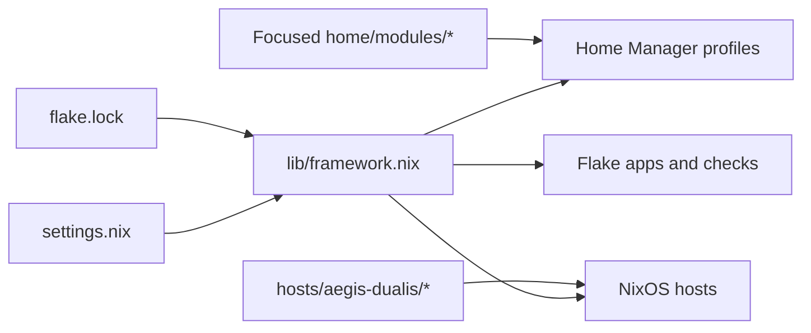

# WHOcares!

[](https://nixos.org/)
[](https://github.com/nix-community/home-manager)
[](#current-targets)

**A flake-powered Linux workstation framework for a fast terminal, a coherent
desktop, reproducible development tools, and guarded privacy workflows.**

WHOcares! currently drives the `malachi@coffin` Home Manager environment and
ships portable `workstation`, `laptop`, and `hp-laptop` targets for new generic
Linux or NixOS machines. Everything is pinned by `flake.lock`, composed from
focused modules, and available through both direct flake apps and short
interactive commands.

```sh
nix run github:tarot-777/WHOcares-#info
```

That command prints the framework's targets, capabilities, and main entry
points without activating the configuration.

## Capabilities

| Area | What WHOcares! provides |
|---|---|
| Reproducible workstation | Pinned Home Manager and NixOS outputs with reusable constructors, overlays, optional profiles, and a development shell |
| Terminal workflow | Zsh and Nushell, Starship, Atuin, Carapace, fzf, Zoxide, Yazi, modern Unix tools, and nearest-flake helpers |
| Editor and Git | Neovim with LSP, completion, formatting, linting, Telescope, Oil, Diffview, Git signs, and framework actions |
| Desktop integration | Niri-oriented Wayland tooling, Kitty, tmux, Dolphin service menus, MIME defaults, notifications, capture, and clipboard tools. Niri and DankMaterialShell (DMS) are exposed as flake inputs and included as default packages for laptop NixOS hosts so a deploy brings up the Niri session and DMS tooling. |
| Media | Shared MPV and Celluloid configuration with UOSC, Thumbfast, MPRIS, SponsorBlock, queues, and watch-later state |
| Operations | Flake apps and shell commands for builds, switches, updates, audits, health checks, package discovery, and garbage collection |
| LLM orchestration | Redacted context bundles, command transcripts, Nix fixpacks, review prompts, browser handoff, and guarded patch application |
| Privacy and virtualization | Signature-checked Whonix extraction and import plus dependency-aware libvirt lifecycle commands |

## How It Fits Together



The repository is intentionally personal at the edges and reusable in the
middle: identity, target names, and the checkout path live in `settings.nix`;
`install.sh` can generate that file for a target machine, and the constructors
in `lib/framework.nix` assemble the pinned modules and inputs.

Repository: <https://github.com/tarot-777/WHOcares->

## Current Targets

| Target | Output | Status |
|---|---|---|
| Generic Linux | `homeConfigurations."malachi@coffin"` | Default and actively switched |
| Generic Linux workstation | `homeConfigurations."malachi@workstation"` | Portable Home Manager target for workstation installs |
| Generic Linux laptop | `homeConfigurations."malachi@laptop"` / `homeConfigurations."malachi@hp-laptop"` | Portable Home Manager targets for mobile installs |
| NixOS Home Manager | `homeConfigurations."malachi@Aegis-Dualis"` | Evaluated profile |
| NixOS host | `nixosConfigurations.Aegis-Dualis` | Host scaffold; adapt boot and filesystem settings before installation |
| NixOS portable hosts | `nixosConfigurations.workstation`, `laptop`, `hp-laptop` | Hardware-neutral baselines; add generated disk hardware config before install |

The current checkout path is `/home/malachi/WHOcares!`, as configured in
`settings.nix`. New machines should run `./install.sh` so `settings.nix` is
rewritten for that user's name, home directory, default host, and checkout path.
Runtime commands can also override the path with `AEGIS_FLAKE` or
`WHOCARES_FLAKE`.

## Deployment Runbook

### Requirements

| Requirement | Generic Linux Home Manager | Existing NixOS switch | Fresh NixOS install |
|---|---:|---:|---:|
| `x86_64-linux` system | yes | yes | yes |
| Nix with flakes enabled | yes | yes | yes, on the installer/controller |
| Network or configured binary cache access | yes | yes | yes |
| User account matching `settings.nix` | yes | yes | created by NixOS module |
| Home Manager installed separately | no, flake app provides it | no, flake app provides it | no |
| Root privileges | no | yes, through `sudo nixos-rebuild` | yes, SSH target must normally be `root@host` |
| Host hardware config | no | yes, `hosts/<host>/hardware-configuration.nix` | yes, generated or supplied for target |
| Disk layout | no | only if rebuilding disks declaratively | yes, explicit `hosts/<host>/disko.nix` |

### Bootstrap Any Machine

Clone or copy the repository, then generate local identity and path settings:

```sh
./install.sh --home-host workstation
```

Useful variants:

```sh
./install.sh --home-host laptop
./install.sh --home-host hp-laptop
./install.sh --target "$HOME/WHOcares" --user "$USER" --home "$HOME"
./install.sh --in-place --home-host coffin --nixos-host Aegis-Dualis
./install.sh --skip-check --home-host workstation
```

`install.sh` writes `settings.nix`, preserves the pinned `flake.lock`, excludes
build outputs while copying, validates known host names, and runs
`nix flake check --no-build --show-trace` unless `--skip-check` is set.

Environment equivalents are available for scripts:

| Variable | Meaning |
|---|---|
| `WHOCARES_TARGET` | Destination checkout path |
| `WHOCARES_USER` | User name written to `settings.nix` |
| `WHOCARES_HOME` | Home directory written to `settings.nix` |
| `WHOCARES_EMAIL` | Email identity written to `settings.nix` |
| `WHOCARES_HOST` | Default Home Manager host |
| `WHOCARES_NIXOS_HOST` | Default NixOS host |

### Generic Linux Activation

Build first, then switch:

```sh
nix run path:$HOME/WHOcares#home-build
nix run path:$HOME/WHOcares#home-switch
```

For this checkout on the current machine:

```sh
env WHOCARES_FLAKE=/home/malachi/WHOcares! nix run .#home-build
env WHOCARES_FLAKE=/home/malachi/WHOcares! nix run .#home-switch
```

After activation, start a new shell or login session so shell, PATH, XDG, and
group-sensitive desktop changes are visible. The installed wrappers are:

```sh
hm-check
hm
hmu
nix-health
whocares-targets
```

### Existing NixOS Switch

1. Copy or generate `hosts/<host>/hardware-configuration.nix`.
2. Review boot loader, filesystems, networking, users, and state version.
3. Run a dry build before switching.

```sh
WHOCARES_NIXOS_HOST=workstation nix run path:$HOME/WHOcares#check
WHOCARES_NIXOS_HOST=workstation nix build \
  path:$HOME/WHOcares#nixosConfigurations.workstation.config.system.build.toplevel
WHOCARES_NIXOS_HOST=workstation nix run path:$HOME/WHOcares#nixos-switch
```

### Fresh NixOS Install

Fresh installs are intentionally guarded. Add both files first:

```text
hosts/<host>/hardware-configuration.nix
hosts/<host>/disko.nix
```

Then install over SSH:

```sh
nix run path:$HOME/WHOcares#nixos-install -- <host> root@<target-ip>
```

The wrapper refuses to run without `hosts/<host>/disko.nix`, unless
`WHOCARES_INSTALL_WITHOUT_DISKO=1` is set for a deliberate pre-mounted or
custom `nixos-anywhere` phase.

### Runtime Overrides

| Override | Effect |
|---|---|
| `WHOCARES_FLAKE` / `AEGIS_FLAKE` | Runtime flake checkout path or flake ref |
| `WHOCARES_HOST` / `AEGIS_HOST` | Home Manager host name used to form `<user>@<host>` |
| `WHOCARES_PROFILE` / `AEGIS_PROFILE` | Full Home Manager profile override |
| `WHOCARES_NIXOS_HOST` / `AEGIS_NIXOS_HOST` | NixOS host output |
| `WHOCARES_NIX_JOBS` | Nix max jobs for wrappers, default `1` |
| `WHOCARES_NIX_CORES` | Nix cores for wrappers, default `2` |
| `WHOCARES_NICE` | CPU niceness for heavy wrapper commands, default `10` |
| `WHOCARES_MIN_FREE_GB` | Free `/nix/store` space required by `nix-safe-update`, default `20` |
| `WHOCARES_ALLOW_LOCAL_BUILDS` | Allow source builds during `nix-safe-update` |
| `WHOCARES_MAX_LOCAL_BUILDS` | Small allowed count of local builds during safe update |

## Pipeline Automation

The canonical workflow runner is available before activation as a flake app and
after activation as an installed command:

```sh
nix run .#pipeline -- inputs
nix run .#pipeline -- plan home-switch
whocares-pipeline inputs
pipeline plan nixos-install
```

Every workflow has an input section, ordered stages, and explicit destructive
gates. Activation and install workflows require `--yes` or an interactive
confirmation.

| Workflow | Inputs | Stages | Output |
|---|---|---|---|
| `inputs` | optional overrides | Print resolved user, profile, host, flake, resources, install target | Human-readable worksheet |
| `plan` | workflow name and overrides | Print inputs plus stage order | Dry operator plan |
| `validate` | flake ref, system | `nix flake check --no-build --show-trace`; source-quality build | Evaluation and lint gate |
| `bootstrap-check` | local checkout, host names | temp copy; `install.sh`; copied `#info` run | Proof bootstrap works off-machine |
| `home-build` | profile, flake, resource limits | validate; Home Manager build | Built profile, no activation |
| `home-switch` | home-build inputs, `--yes` or prompt | validate; build; confirmation; switch | Active Home Manager generation |
| `nixos-build` | NixOS host, flake | validate; build host toplevel | NixOS closure, no activation |
| `nixos-switch` | NixOS host, sudo, `--yes` or prompt | validate; build; confirmation; switch | Active NixOS generation |
| `nixos-install` | local checkout, host, SSH target, `disko.nix`, `--yes` or prompt | guard checks; confirmation; `nixos-anywhere` | Fresh target install |

Common runs:

```sh
# Show every input the runner will use.
nix run .#pipeline -- inputs

# Full validation gate, including source-quality derivation.
nix run .#pipeline -- validate

# Preview the exact stages before a switch.
nix run .#pipeline -- plan home-switch

# Build current Home Manager profile without switching.
nix run .#pipeline -- home-build

# Activate Home Manager after build and validation.
nix run .#pipeline -- home-switch --yes

# Validate that a copied checkout can bootstrap itself.
nix run .#pipeline -- bootstrap-check --host laptop --nixos-host laptop

# Build a portable NixOS host without switching.
nix run .#pipeline -- nixos-build --nixos-host workstation

# Fresh install, still guarded by hosts/<host>/disko.nix.
nix run .#pipeline -- nixos-install --nixos-host laptop --target root@192.0.2.20 --yes
```

Pipeline options:

| Option | Purpose |
|---|---|
| `--flake PATH_OR_REF` | Use a different checkout or flake ref |
| `--host HOST` | Select the Home Manager host suffix |
| `--profile USER@HOST` | Select the exact Home Manager profile |
| `--nixos-host HOST` | Select the NixOS host output |
| `--system SYSTEM` | Select the flake check system |
| `--target SSH_TARGET` | Set the `nixos-anywhere` SSH target |
| `--skip-source-quality` | Skip the source-quality derivation |
| `--skip-eval` | Skip no-build flake evaluation |
| `--dry-run` | Print commands without executing them |
| `--yes` | Permit activation/install stages non-interactively |

The active `coffin` host is Arch Linux, not NixOS. Its `/etc/fstab` mounts a
Btrfs filesystem on `ArchinstallVg-root` using `@`, `@home`, `@pkg`, and `@log`
subvolumes plus a VFAT `/boot`. The experimental NixOS output currently uses a
temporary root placeholder and must not be used to reinstall this host until a
real hardware and disk configuration is added.

## Quick Start

Inspect or enter the project without changing the machine:

```sh
nix run .
nix develop
nix flake check --no-build --show-trace
```

Prepare this checkout for the current machine without activating it:

```sh
./install.sh --in-place --home-host workstation --skip-check
```

Build and activate the configured Home Manager target:

```sh
nix run .#home-build
nix run .#home-switch
```

After the first switch, the shorter wrappers are available:

```sh
hm-check        # low-priority Home Manager build
hm              # low-priority Home Manager switch
nix-safe-update # update, check, refuse source builds by default, diff, switch
nix-audit       # deadnix + statix
nix-fmt         # format Nix files with alejandra
nix-up          # update flake.lock
nix-health      # versions, outputs, and Home Manager build
```

`nix-safe-update` defaults to `WHOCARES_NIX_JOBS=1`, `WHOCARES_NIX_CORES=2`,
and `WHOCARES_MIN_FREE_GB=20`. It refuses local source builds unless
`WHOCARES_ALLOW_LOCAL_BUILDS=1` is set or `WHOCARES_MAX_LOCAL_BUILDS` is raised.

Use `WHOCARES_HOST` / `AEGIS_HOST` for Home Manager profile overrides and
`WHOCARES_NIXOS_HOST` / `AEGIS_NIXOS_HOST` for NixOS host overrides. If you use
`nh` directly, pass the flake path and `-c <user>@<host>` separately; do not pass
`.#<user>@<host>` as the flake path.

## Zsh And Plugins

Home Manager owns the Zsh configuration and all plugin source paths. Shell
startup never clones repositories or downloads plugins.

Managed plugins:

- `fzf-tab`: context-aware completion previews
- `zsh-vi-mode`: full vi editing with `jk` to leave insert mode
- `zsh-autopair`: paired quotes, brackets, and braces
- `zsh-you-should-use`: reminders when an existing alias matches a command
- `nix-zsh-completions`: Nix command and option completion
- `zsh-nix-shell`: preserve the configured interactive Zsh inside `nix-shell`
- Home Manager integrations: autosuggestions, syntax highlighting, Atuin,
  Carapace, fzf, Starship, Zoxide, direnv, and Yazi

Starship, Atuin, Zoxide, direnv, Carapace, and Yazi are also integrated with
Nushell. Both shells include nearest-flake helpers for checks, development
shells, Home Manager builds, and switches.

Plugin commands:

```sh
zpl            # display plugin names and pinned versions
zpr            # reload Zsh
zpu            # update flake inputs, then run hm
```

Plugin versions follow the pinned `nixpkgs` input. Review `flake.lock`, run
`nix-up`, then activate with `hm`.

## Useful Shell Commands

The configuration includes modern replacements (`eza`, `bat`, `fd`, `rg`,
`dust`, `duf`, `procs`, `btop`) and focused shortcuts:

| Area | Commands |
|---|---|
| Navigation | `..`, `...`, `....`, `dots`, `mkcd`, `cdf`, `z`, `yy` |
| Git | `g`, `gs`, `ga`, `gaa`, `gc`, `gco`, `gd`, `gds`, `gl`, `gp`, `gpl`, `lg`, `git-root` |
| Nix | `nd`, `nfl`, `nr`, `ns`, `nfc`, `ndev`, `nshow`, `hm`, `hm-check`, `home-build`, `home-switch`, `nfind`, `nopt`, `nlock`, `ndix` |
| Data and logic | `jqx`, `csv`, `sr`, `fq`, `dasel`, `miller`, `choose` |
| Process workflow | `pq`, `mp`, `watch`, `fkill`, `entr`, `watchexec` |
| Network and privacy | `ports`, `listening`, `netmon`, `px`, `torify`, `tor-status` |
| Containers | `dk`, `dkc`, `dkps`, `dbx`, `lzd`, `nctr`, `ncompose` |
| General | `extract`, `serve`, `cs`, `nav`, `md`, `tcheck`, `awesome` |

Run `awesome-list` for the live inventory and `tools-check` to audit command
availability.

## LLM Orchestrator

`home/modules/llm-orchestrator.nix` provides self-documenting automation for
working with ChatGPT, Gemini, Claude, Perplexity, Copilot, or another assistant.
It captures bounded, redacted machine and repository context so failures and
changes can be handed off without manually reconstructing what happened.

| Command | Action |
|---|---|
| `why [term]` / `skills [term]` | Search the local command registry and explain what a tool does |
| `ctx` | Print a redacted Markdown context bundle for the current repo |
| `ctx --copy --open chatgpt` | Copy context to the clipboard and open ChatGPT |
| `llm-copy` | Copy stdin, files, or directory context as an LLM-ready prompt |
| `llm-open gemini FILE` | Copy a prompt and open Gemini, ChatGPT, Claude, Perplexity, or Copilot |
| `runlog COMMAND ...` | Run a command, save the transcript, and copy a debug prompt |
| `hm-doctor` / `nix-fixpack` | Build a full Home Manager/Nix diagnostic bundle with logs |
| `llm-review` | Package current Git changes for model review |
| `llm-patch` / `aipatch` | Validate and apply an AI patch on a new Git branch, then run checks |
| `lastlog` / `lastask` | Rerun or explain the previous command from interactive Zsh history |

Common workflows:

```sh
ctx --copy --open chatgpt
runlog hm-check
nix-fixpack --open gemini
llm-review --open chatgpt
llm-patch --clipboard
```

Generated bundles live under
`~/.local/state/whocares/llm-orchestrator`. Common token, key, password, and
authorization patterns are redacted, but review a bundle before sending it to
an external service.

## Neovim

Neovim uses only pinned nixpkgs plugins and tool binaries. In addition to LSP,
completion, formatting, Telescope, Oil, Git signs, and terminal support, it
includes:

- `nvim-lint` with Statix, Deadnix, and ShellCheck
- Diffview for repository changes and file history
- Fidget for LSP progress and `direnv.vim` for environment refreshes
- framework searches under `<leader>nf` and `<leader>ng`
- Nix actions under `<leader>n`: develop, flake check, Home Manager build, and
  Home Manager switch

## Dolphin

Dolphin is the default directory handler and includes Ark, KIO extras,
`admin:/`, thumbnail support, and Git integration. Its `WHOcares!` context menu
can open the selected location in Kitty, edit it with Neovim, or find the
nearest flake and enter `nix develop`.

Shell shortcuts: `fm`, `fmh`, and `fma`.

## Media

Celluloid is the graphical media default and uses the same MPV configuration as
the CLI. MPV includes UOSC, Thumbfast, MPRIS, SponsorBlock, quality selection,
autoload, and watch-later support.

| Command | Action |
|---|---|
| `play FILE` | Play and preserve position |
| `audio FILE` | Audio-only playback |
| `shuffle DIR` | Shuffle and loop a playlist |
| `queue FILE...` | Add files or URLs to the persistent WHOcares MPV session |
| `media-clear` | Clear that session's playlist |
| `now` | Show MPV status through MPRIS |

## Kitty

Kitty remains the default terminal with tmux, hints, remote control, and quick
launch bindings. Nix-aware tabs are available through `kitty-framework` or:

| Command | Action |
|---|---|
| `ka` | Open the configured framework root |
| `kdev` | Open a tab running `nix develop` |
| `kcheck` | Open a tab running the Home Manager build |

The matching keybindings are `Ctrl+Shift+Alt+R`, `D`, `C`, and `S` for a
framework shell, development shell, build, and switch.

## Awesome-List Integration

`home/modules/awesome-tools.nix` maps a curated selection from Awesome Nix,
Awesome CLI Apps, and Awesome Linux Containers into nixpkgs. Notable workflow
tools include:

- `pueue`: persistent background command queue (`pq`)
- `mprocs`: monitor several long-running commands (`mp`)
- `sad`: preview search-and-replace operations (`sr`)
- `jqp`: interactive jq exploration (`jqx`)
- `viddy`: watch output with history and diffs (`watch`)
- `entr`: rerun a command when files change
- `csvlens`: interactive CSV inspection (`csv`)
- `gum`: readable interactive shell workflows

Reference repositories are optional and are not cloned during activation:

```sh
repos                         # clone/update configured references
repo-list                     # list cloned references
awsrc nix                     # Awesome Nix README
awsrc zsh                     # Awesome Zsh Plugins README
awsrc cli                     # Awesome CLI Apps README
awsrc containers              # Awesome Linux Containers README
```

They live under `~/.local/share/whocares/repos`.

## Whonix

The Home Manager profile installs a `whonix` controller for the libvirt system
connection (`qemu:///system`) and provides these aliases:

| Alias | Action |
|---|---|
| `wx` | Start Gateway, wait briefly, then start Workstation |
| `wxs` | Show both VM states and interfaces |
| `wxd` | Check KVM, libvirt, domains, and Whonix networks |
| `wxsetup` | Enable libvirt and add the user to host virtualization groups |
| `wxverify FILE` | Verify the archive signature and documented signing-key fingerprint |
| `wxextract FILE [DIR]` | Verify and sparsely extract an official KVM archive |
| `wximport DIR` | Import an extracted official Whonix KVM package |
| `wxv` / `wxvg` | Open the Workstation / Gateway in `virt-viewer` |
| `wxstop` | Gracefully stop Workstation, then Gateway |
| `wxrestart` | Stop and restart both in dependency order |
| `wxconsole` / `wxgw` | Open Workstation / Gateway serial console |
| `wxnet` | Show Workstation interfaces |

The controller uses Whonix's official domain and network names:
`Whonix-Gateway`, `Whonix-Workstation`, `Whonix-External`, and
`Whonix-Internal`. It also recognizes the old local `whonix-gw` /
`whonix-ws` domain names when they already exist.

Initial setup on Arch Linux or another systemd host:

```sh
wxd
wxsetup

# Download the archive from the official page, then:
wxverify Whonix*.libvirt.xz
wxextract Whonix*.libvirt.xz

# Read and accept the bundled binary license as directed by Whonix, then:
wximport /path/to/extracted-directory
wxd
wx
```

Download the official KVM images from <https://www.whonix.org/wiki/KVM> and
verify them using
<https://www.whonix.org/wiki/Verify_the_images_using_Linux>. Downloading
acknowledges Whonix's terms and license, so the framework does not download or
accept them automatically.

`wxverify` uses a temporary GnuPG home, checks Whonix's documented fingerprint
`916B 8D99 C38E AF5E 8ADC 7A2A 8D66 066A 2EEA CCDA`, and verifies the adjacent
signature without changing the user's keyring. `wximport` requires the package's
`WHONIX_BINARY_LICENSE_AGREEMENT_accepted` marker, preserves sparse qcow2
images, installs them under `/var/lib/libvirt/images`, imports Whonix's own XML,
and enables both official networks. The NixOS module deliberately provides
host prerequisites only; VM definitions remain owned by the Whonix package so
they do not drift from upstream security defaults.

The full command also supports `whonix force-stop`, `whonix network`, and
`whonix provision DIR`. Run `whonix help` for details.

## Feature Profiles

Edit `home/malachi/default.nix`:

```nix
whycare = {
  enableFullPower = false;
  shell.enable = true;
  externalRepos.enable = true;

  llmOrchestrator = {
    enable = true;
    browser = "brave";
    maxFileBytes = 50000;
    maxFilesBrief = 35;
    maxFilesFull = 90;
  };

  profiles = {
    full.enable = false;
    graphics.enable = false;
    office.enable = false;
    vms.enable = false;
    rocm.enable = false;
    browser = "brave"; # or "firefox"
  };
};
```

The base profile already contains a substantial security and development
toolchain. Optional profiles add graphics, office, VM, or ROCm packages.

## Development And Validation

```sh
nix develop .#aegis-dev
nix fmt
statix check .
deadnix .
nix flake check --show-trace
nix build .#checks.x86_64-linux.source-quality --no-link
nix run .#home-build
```

The dev shell includes `nh`, Home Manager, Alejandra, Statix, Deadnix, `nil`,
`nixd`, and `ripgrep`. The full flake check evaluates every output and runs the
repository's Alejandra, Statix, Deadnix, and ShellCheck quality gate. Add
`--no-build` when only an evaluation check is needed.

Before activating or deploying elsewhere, verify:

```sh
nix run .#info
nix run .#check
nix run .#home-build
```

Use `nix build .#checks.x86_64-linux.source-quality --no-link` when you need
the formatter, Statix, Deadnix, and ShellCheck derivation to actually build and
run rather than only evaluate.

## Layout

```text
.
├── flake.nix
├── flake.lock
├── CONTRIBUTING.md
├── statix.toml
├── settings.nix
├── lib/framework.nix
├── home/
│   ├── malachi/default.nix
│   └── modules/
│       ├── awesome-tools.nix
│       ├── dolphin.nix
│       ├── external-repos.nix
│       ├── kitty.nix
│       ├── llm-orchestrator.nix
│       ├── media.nix
│       ├── nvim.nix
│       ├── profiles.nix
│       ├── shell.nix
│       ├── tmux.nix
│       ├── whonix.nix
│       └── zsh.nix
├── hosts/aegis-dualis/
│   ├── default.nix
│   └── whonix-vms.nix
└── shells/aegis-dev/default.nix
```

## Troubleshooting

- `path does not contain a flake.nix`: run commands from the repository root
  or set `WHOCARES_FLAKE=/path/to/WHOcares`.
- Missing Home Manager configuration: use
  `nix run .#info` to list the configured profile, then set
  `WHOCARES_HOST=workstation`, `WHOCARES_HOST=laptop`, or
  `WHOCARES_PROFILE=<user>@<host>`.
- Whonix domain undefined: run `wxd`, verify and extract the official archive,
  accept its bundled license, then run `wximport` on the extracted directory.
- Permission denied for `qemu:///system`: add the user to the host's `libvirt`
  group and start a new login session.
- First activation may build the local `nix-index` database and can take
  longer than later switches.
- `cannot connect to socket at /nix/var/nix/daemon-socket/socket`: the caller
  cannot reach the Nix daemon. On a normal system, ensure the daemon is running
  and the user can access it; inside a restricted sandbox, run the command
  outside the sandbox.
- Plasma wallpaper errors during activation are non-fatal for this Niri-focused
  profile. The Stylix wallpaper file is still generated; Plasma may simply not
  be available on the current session bus.
- Non-NixOS GPU setup warnings are informational until a Nix-built graphical
  app needs host GPU driver integration. Run the printed `non-nixos-gpu-setup`
  command only after reviewing it for the host distro.
- If activation changes shell files but the current shell still behaves the old
  way, run `exec zsh` or start a fresh login session.
